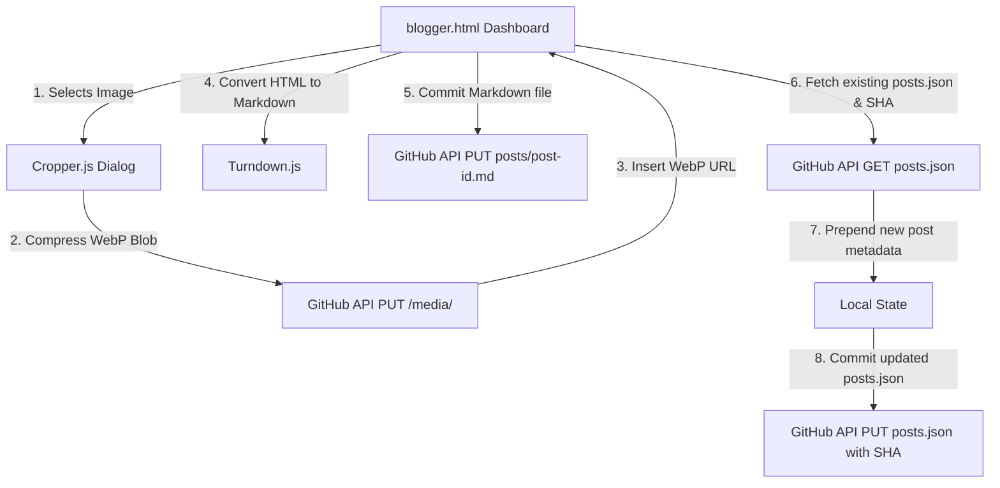

# Architectural & Design Decisions Log

This log explains the implementation details, reasoning, and technical dependencies chosen for the Game Design Blog project.

---

## 1. Chosen Stack & Libraries (Latest 2026 Versions)

| Tool / Library | Version | Delivery Method | Purpose / Choice |
| :--- | :--- | :--- | :--- |
| **Bootstrap** | `5.3.3` | CDN (jsDelivr) | Grid layout and responsive typography framework. Minimalist design system overrides default styles. |
| **marked.js** | `12.0.0` | CDN (jsDelivr) | Compiles Markdown files to clean, secure HTML on the client side. Used for rendering individual posts dynamically. |
| **Quill.js** | `2.0.2` | CDN (jsDelivr) | Rich WYSIWYG editor for writing posts. Offers visual text formatting (bold, italic, header structure) while remaining lightweight. |
| **Cropper.js** | `1.6.2` | CDN (jsDelivr) | High-performance image cropper. Intercepts image uploads, allowing the blogger to crop game screenshots before saving. |
| **Turndown.js** | `7.1.3` | CDN (jsDelivr) | Translates rich HTML output from the Quill editor back into clean, readable Markdown (`.md`) files. |
| **Inter Font** | Google Fonts | Web CDN | Used as the main body font. Clean, highly legible sans-serif. |
| **Lora Font** | Google Fonts | Web CDN | Elegant serif font for blog post bodies to mimic physical books or premium game design journals. |

---

## 2. Minimalist Visual Decisions
The user requested a **clean typographic style** with **no gradients, noise, or modern glow trends**.
- **Monochrome & High Contrast**: Built on standard black-and-white accents. Off-white (`#fcfcfc`) for reading comfort, black (`#111111`) for text, and dark grey borders (`#e0e0e0`).
- **Sharp Edges**: Cards have `border-radius: 0px` (sharp corners). Heavy drop shadows are omitted in favor of solid thin border color changes (`1px solid #111111`) on hover.
- **Color Variables**: All colors use CSS variables (`--bg-color`, `--text-color`, `--border-color`) to support an instant dark/light mode toggle with zero layout adjustments.

---

## 3. Storage & Publishing Architecture (GitHub API Integration)

By using the **GitHub REST API**, we avoid paying for databases, avoid database throttling, and maintain 100% control over files.



### Decoupling and Safety (The `posts.json` Database)
- The landing page does not scan the folder directory (which is impossible client-side in a static site). Instead, it queries a single lightweight registry file: `posts.json`.
- This registry is a simple JSON array. If you ever want to manually add or delete a post, you can just drop a `.md` file in the `/posts/` directory and add/remove its entry in `posts.json`. The site will read this index and adjust immediately. It is impossible to "break" the site code this way.

### Client-Side Image Crop & WebP Compression
- Game screenshots can be multi-megabyte files, which would quickly bloat a Git repository.
- We utilize `Cropper.js` to crop the image to a selected aspect ratio.
- We convert the crop canvas to a `WebP` blob using:
  ```javascript
  canvas.toBlob(callback, 'image/webp', 0.8)
  ```
- This reduces the image file size to a highly optimized `100KB - 200KB` file.
- The compressed base64 string is uploaded directly to your GitHub repository in the `posts/media/` folder.

### HTML-to-Markdown (Quill + Turndown)
- To give the writer a beautiful WYSIWYG experience, we use `Quill.js` which outputs HTML.
- However, we want to save posts as standard Markdown `.md` files so that they remain human-friendly and easily editable in Git.
- When the publisher clicks "Publish", `Turndown.js` automatically parses Quill's HTML output, translating tags (e.g. `<h2>`, `<strong>`, `<ul>`) into standard Markdown (e.g. `##`, `**`, `*`).
- The resulting Markdown document is pushed to GitHub. When a reader opens the page, `marked.js` translates it back to HTML.

---

## 4. Template Title Fix & Markdown H1 Header Stripping
- **The Issue**: In the initial post reader page view (`post.html`), the header showed "Loading post..." indefinitely instead of updating to the active post's title. Furthermore, if a markdown post file itself started with an `# H1` title (as standard markdown files often do), it resulted in a duplicate rendering: once in the page template meta header, and once in the compiled HTML content.
- **The Fix**: 
  1. Updated `post.js`'s `renderMetadata` function to set `postTitle.textContent = metadata.title`, replacing the loading placeholder.
  2. Implemented string matching inside `fetchAndRenderMarkdown` to parse the fetched raw markdown text. If it detects a leading `# H1` header line matching the post's title, it shifts that line off the content array before compiling it into HTML. This maintains clean, dry typography for all posts.

---

## 5. GitHub API CORS & Cache-Control Configuration
- **The Issue**: When navigating to the "Manage Posts" tab, the browser console threw a `Cross-Origin Request Blocked: Same Origin Policy` preflight error, reporting that the `'cache-control'` request header is not allowed by GitHub's `Access-Control-Allow-Headers` CORS headers. This caused the fetch operation to fail with a browser `NetworkError`.
- **The Fix**: Removed the `'Cache-Control': 'no-cache'` header from the fetch settings. Instead, we appended a dynamic timestamp parameter (`&t=Date.now()`) to the request query parameters. This achieves the same cache-bypassing goal without triggering preflight CORS errors on the GitHub API.

---

## 6. Dynamic Tab Active Underline & Text Toggling
- **The Issue**: In the publisher dashboard, switching between "Write Post" and "Manage Posts" tabs did not toggle the active underline styling and font-color darkness. The active line remained stuck under "Write Post", and the "Manage Posts" label remained stuck as greyed-out text, even when its tab panel content was displayed. This occurred because active styling (e.g., `text-dark`, `border-bottom: 2px solid...`) was defined as static inline styles and helper classes in the HTML, preventing Bootstrap's dynamic `.active` class toggles from applying properly.
- **The Fix**: Removed all inline styles and static text-weight classes from the tab buttons in `blogger.html`. Added CSS rules in `style.css` targeting `#dashboardTabs .nav-link` that transition colors and borders based on the presence of the `.active` class. This allows the styling and highlights to toggle dynamically.
